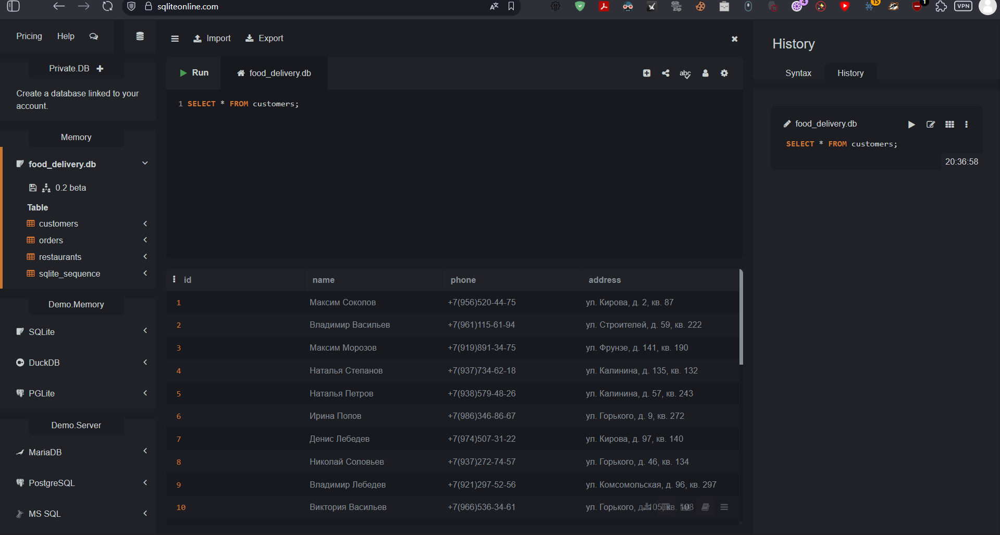
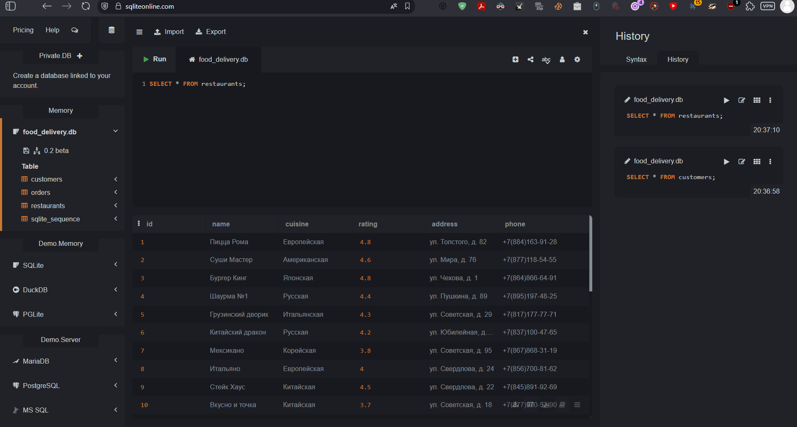
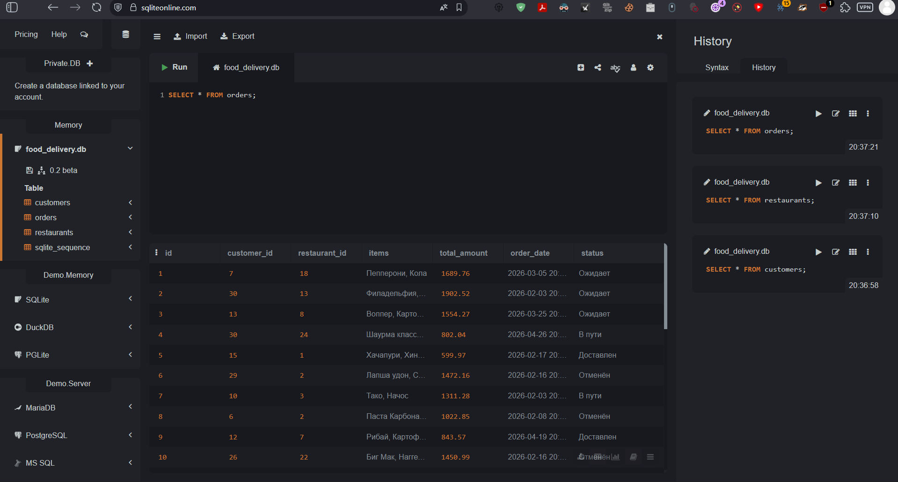

База данных службы доставки еды

Описание проекта

Проект представляет собой реляционную базу данных для службы доставки еды, созданную на языке Python с использованием SQLite. База данных содержит три взаимосвязанные таблицы с тридцатью записями в каждой. Реализованы внешние ключи для связи таблиц.

Структура базы данных

Таблица customers (Клиенты)

id — целое число, первичный ключ, автоинкремент
name — текст, имя клиента
phone — текст, номер телефона
address — текст, адрес доставки

Таблица restaurants (Рестораны)

id — целое число, первичный ключ, автоинкремент
name — текст, название ресторана
cuisine — текст, тип кухни
rating — вещественное число, рейтинг от 0 до 5
address — текст, адрес ресторана
phone — текст, номер телефона

Таблица orders (Заказы)

id — целое число, первичный ключ, автоинкремент
customer_id — целое число, внешний ключ на таблицу customers
restaurant_id — целое число, внешний ключ на таблицу restaurants
items — текст, список заказанных блюд
total_amount — вещественное число, сумма заказа
order_date — текст, дата и время заказа
status — текст, статус заказа

Скриншоты таблиц

Скриншоты получены через сервис SQLite Online.

Таблица customers

Таблица restaurants

Таблица orders

SQL запросы

Простые запросы

1. Вывод всех клиентов
2. Вывод ресторанов итальянской кухни с телефонами
3. Вывод доставленных заказов
4. Вывод ресторанов по убыванию рейтинга
5. Вывод уникальных типов кухни

Сложные запросы

1. Соединение клиентов и заказов с фильтром по сумме
2. Подсчет количества заказов по каждому ресторану
3. Заказы с диапазоном суммы и статусом доставлен
4. Клиенты с отмененными заказами через подзапрос
5. Рестораны с высоким рейтингом и азиатской кухней
6. Заказы за апрель без определенных статусов
7. Клиенты с общей суммой заказов больше 2000
8. Средний рейтинг и количество заказов по кухням
9. Клиенты на улицах Ленина или Пушкина
10. Активные заказы с суммой больше 800 с данными клиента и ресторана
11. Статистика по статусам заказов
12. Рестораны с рейтингом в диапазоне без определенных кухонь
13. Клиенты с количеством заказов и максимальной суммой
14. Доставленные или в пути заказы с суммой и датой
15. Рестораны с количеством доставленных заказов через подзапрос

Запуск проекта

python database.py

Файлы проекта

database.py — скрипт для создания и заполнения базы данных
food_delivery.db — файл базы данных SQLite
queries.sql — файл с SQL запросами
